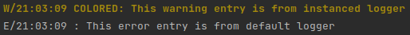
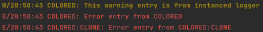

# GoLogger

Providing an interface to leveled logging system and a basic implementation in `GO` programming language.

## Requirements

- `GO v1.18+`

## Installation

`go get -u github.com/chitholian/GoLogger`

## Usage Examples

- You can use your own implementation of the `ILogger` interface.

We have provided a basic implementation to be used out of the box.

### Using the Default Logger

```go
package main

import log "github.com/chitholian/GoLogger"

func main() {
	// Increase default log level.
	l := log.GetDefault()
	l.SetLevel(log.LevelTrace)
	log.Println(log.LevelInfo, "This is", "an", "info level log")
	log.Printf(log.LevelInfo, "Log level: %d (%s) using formatter string", log.LevelInfo, "LevelInfo")
}
```

Output:

```text
I/23:00:00 : This is an info level log
I/23:00:00 : Log level: 4 (LevelInfo) using formatter string
```

### Using a Logger Instance

```go
package main

import (
	log "github.com/chitholian/GoLogger"
	"os"
)

func main() {
	// Create a logger with debug level and colorization feature.
	l := log.New(log.LevelDebug, "COLORED", os.Stderr, log.FlagColorMode)
	l.Println(log.LevelWarn, "This warning entry is from instanced logger")

	// Also default logger can be used simultaneously.
	log.Println(log.LevelError, "This error entry is from default logger")
}
```

Output:



### Cloning a Logger Instance

```go
package main

import (
	log "github.com/chitholian/GoLogger"
	"os"
)

func main() {
	// Create a logger with debug level and colorization feature.
	l := log.New(log.LevelDebug, "COLORED", os.Stderr, log.FlagColorMode)
	l.Println(log.LevelWarn, "This warning entry is from instanced logger")

	// Clone the logger
	clone := l.Clone()
	// Change the prefix of cloned logger.
	clone.SetPrefix(clone.GetPrefix() + ":CLONE")

	// Both can be used independently.
	l.Println(log.LevelError, "Error entry from COLORED")
	clone.Println(log.LevelError, "Error entry from COLORED:CLONE")
}
```

Output:


